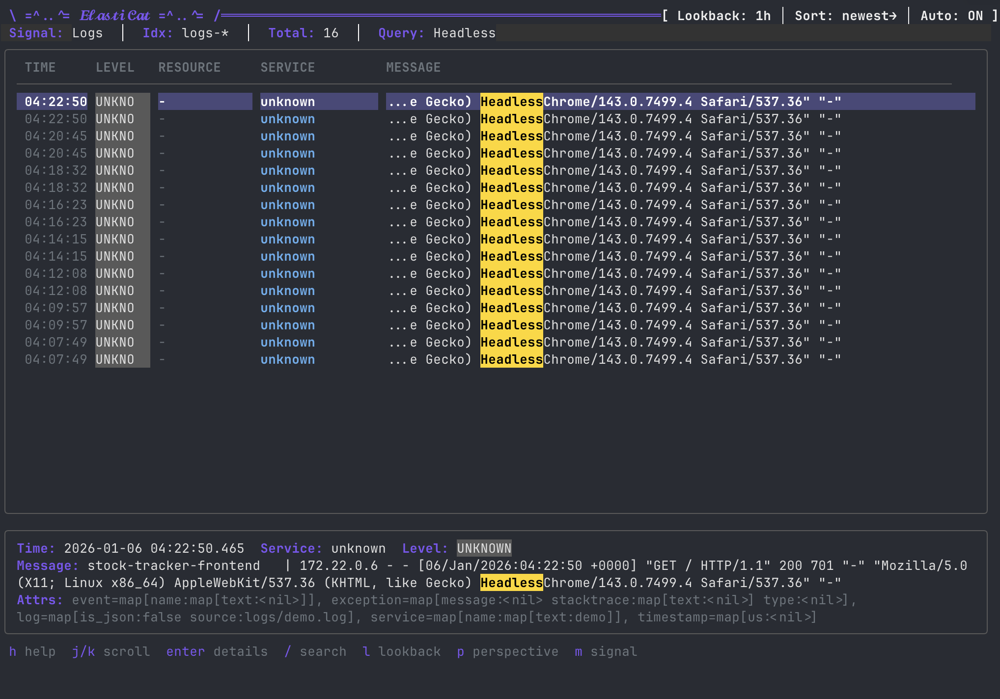
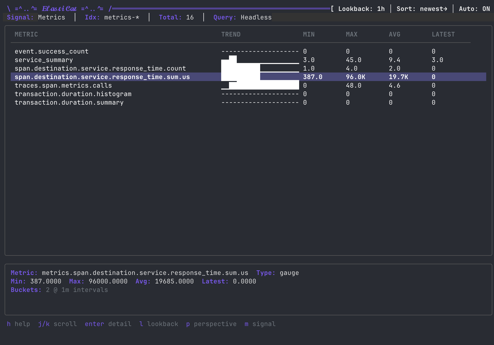
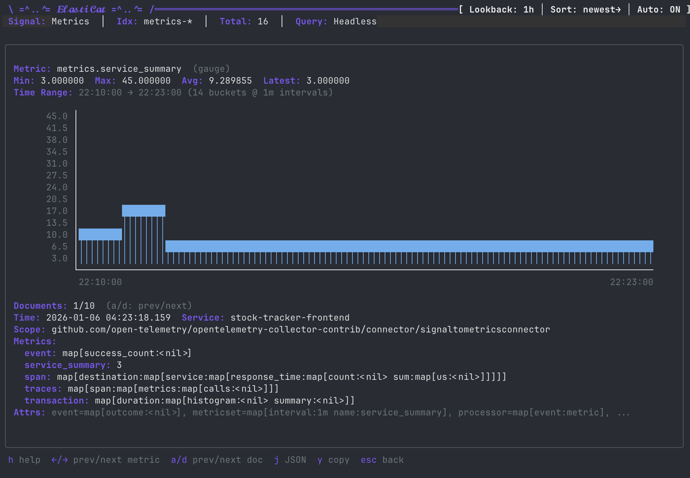
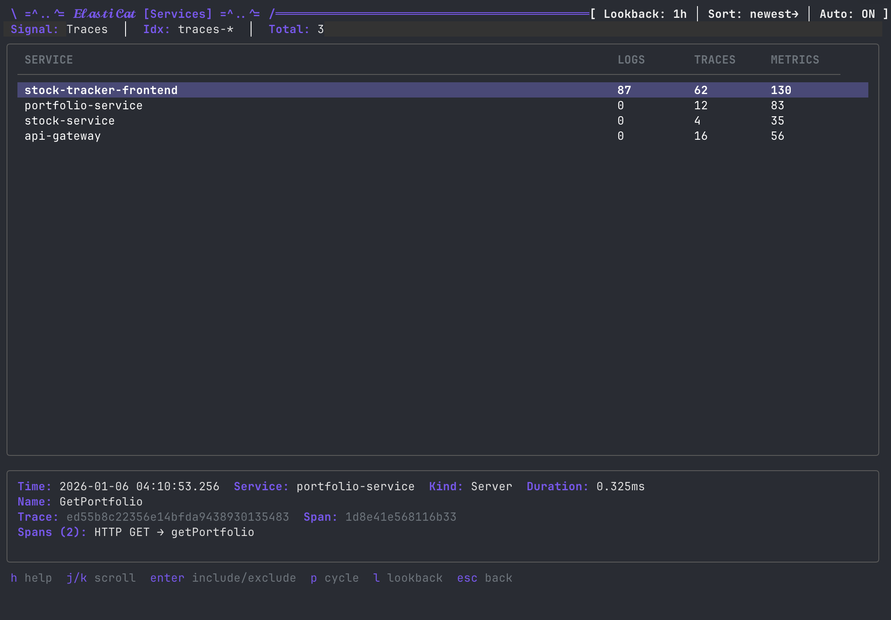
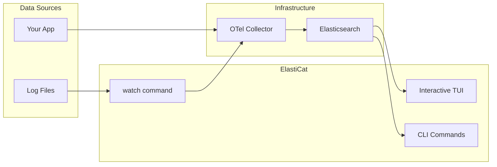

# ElastiCat

**A TUI for OpenTelemetry powered by Elasticsearch**

[](https://github.com/elastic/elasticat/actions/workflows/ci.yml?query=branch%3Amain)
[](LICENSE.txt)
[](https://go.dev/)

<p align="center">
  
</p>

## Features

- **Log File Watcher** - Tail files with `elasticat watch my-app*.log` and auto-ingest to Elasticsearch via OTLP
- **Instantly OpenTelemetry Stack - Powered by Elastic** - Just run `elasticat up`, runs [Elastic start-local](https://github.com/elastic/start-local)
- **Interactive TUI** - Browse logs, metrics, and traces with vim-style navigation with `elasticat ui`
- **AI Chat Assistant** - Press `c` to chat with an AI about your observability data, powered by Elastic Agent Builder
- **OTel Collector Config Editing** - Press `O` to edit the collector config in your editor with live reload
- **CLI Commands** - Query and filter telemetry data in ES as JSON from scripts or pipelines with `elasticat {logs|metrics|traces}`
- **Multi-Signal Support** - Unified interface for logs, metrics, and traces
- **Perspectives** - Filter by service, host, or any dimension with a single keystroke
- **Kibana Integration** - Open your browser with the current view in Kibana with `K`

## Table of Contents

- [Prerequisites](#prerequisites)
- [Quick Start](#quick-start)
- [The TUI](#the-tui)
  - [AI Chat Assistant](#ai-chat-assistant)
  - [OTel Collector Config Editing](#otel-collector-config-editing)
- [Demo App](#demo-app)
- [Commands Reference](#commands-reference)
- [Configuration](#configuration)
- [Troubleshooting](#troubleshooting)
- [Building from Source](#building-from-source)
- [Documentation](#documentation)
- [Contributing](#contributing)
- [License](#license)

## Prerequisites

| Requirement | Notes |
|-------------|-------|
| **Docker** or **Podman** | Required for `elasticat up` (local stack) |
| **macOS / Linux / Windows (WSL)** | Pre-built binaries are available as CI artifacts from `main` |

No Go installation required if you download a pre-built binary.

## Quick Start

### 1. Get `elasticat`

**One-liner install (macOS / Linux):**

```bash
curl -fsSL https://raw.githubusercontent.com/elastic/elasticat/main/install.sh | bash -s -- --prerelease
```

This downloads the latest release and installs it to `/usr/local/bin` (or `~/.local/bin`).

> **Note:** While elasticat is in alpha, use `--prerelease` to install. Once stable releases are available, you can omit this flag.

**Alternatives:**
- Download a pre-built binary from [GitHub Releases](https://github.com/elastic/elasticat/releases)
- For the latest `main` build, download from [CI workflow runs](https://github.com/elastic/elasticat/actions/workflows/ci.yml?query=branch%3Amain)
- [Build from source](#building-from-source)

### 2. Start the stack

```bash
elasticat up
```

This starts Elasticsearch, Kibana, and the EDOT (Elastic Distribution of OpenTelemetry) collector using [Elastic start-local](https://github.com/elastic/start-local). Uses Docker if available, otherwise Podman. Credentials are automatically saved.

### 3. Watch your logs

```bash
# Watch and send to OTLP
elasticat watch ./server.log

# Multiple files / globs
elasticat watch ./logs/*.log ./other.log

# Display only (don't send)
elasticat watch --no-send ./server.log
```

### 4. Open the TUI

```bash
elasticat ui           # Logs (default)
elasticat ui metrics   # Metrics
elasticat ui traces    # Traces
```

### 5. Check status

```bash
elasticat status   # Is Elasticsearch reachable?
elasticat clear    # Delete all telemetry data
```

## The TUI

The terminal UI provides an interactive way to explore your telemetry data with vim-style navigation.

### Logs

<p align="center">
  
</p>

Browse log entries with syntax highlighting, filter by level, search, and drill into details.

### Metrics

<p align="center">
  
</p>

<p align="center">
  
</p>

View metric summaries and drill into individual metrics with sparkline visualizations.

### Traces

<p align="center">
  
</p>

Explore distributed traces, view spans, and navigate between transactions.

### Perspectives (Filter by Service)

<p align="center">
  
</p>

Press `p` to filter by service, host, or any dimension - works across all signal types.

### AI Chat Assistant

Press `c` to open an AI-powered chat assistant. Ask questions about your observability data in natural language:

- "Why are there so many errors from the gateway service?"
- "What's causing the latency spike in the last hour?"
- "Summarize the trace I'm looking at"

The AI has context about your current view, filters, and selected items, powered by [Elastic Agent Builder](https://www.elastic.co/guide/en/security/current/security-assistant.html).

### OTel Collector Config Editing

Press `O` (capital O) to edit the OpenTelemetry collector configuration for local development:

- Opens `~/.elastic-start-local/config/otel-config.yaml` in your default editor
- Automatically extracts the inline config from docker-compose on first use
- Watches for changes and validates the config when saved
- Sends SIGHUP to reload the collector without restarting

This makes it easy to experiment with processors, exporters, and pipelines during development.

### Quick Keybindings

| Key | Action | Context |
|-----|--------|---------|
| `j` / `k` | Scroll up/down | All views |
| `Enter` | View details | List views |
| `/` | Search | All views |
| `l` | Change lookback period | All views |
| `p` | Open perspectives (filter by service, host, etc.) | All views |
| `m` | Switch signal (logs/metrics/traces) | All views |
| `c` | Open AI chat assistant | All views |
| `C` | Send selected item to AI chat | Detail views |
| `O` | Edit OTel collector config | All views |
| `f` | Configure visible fields | Logs |
| `s` | Toggle sort order | Logs |
| `0-4` | Filter by log level | Logs |
| `K` | Open in Kibana (shows credentials, then press enter) | All views |
| `X` | Show stack credentials | All views |
| `h` | Show full help | All views |
| `q` | Quit | All views |

### Detail View

| Key | Action |
|-----|--------|
| `↑` / `↓` | Scroll content |
| `←` / `→` | Previous/next document |
| `j` | Toggle JSON view |
| `y` | Copy to clipboard |
| `Esc` | Close |

Press `h` in any view to see the complete keybinding reference.

## Demo App

The [Stock Tracker Demo](examples/stock-tracker/) is a complete microservices example (React frontend + Go backend) with OpenTelemetry instrumentation. Great for seeing ElastiCat in action with real data.

```bash
cd examples/stock-tracker
docker compose up -d

# Capture logs to a file
docker compose logs -f gateway stock-service portfolio-service > logs/demo.log 2>&1 &

# From the repo root, watch the captured file
cd ../../
elasticat watch examples/stock-tracker/logs/demo.log

# In another terminal
elasticat ui
```

## Commands Reference

### How It Works



### Global Flags

These flags work on all commands:

| Flag | Default | Description |
|------|---------|-------------|
| `--profile` | (none) | Configuration profile to use |
| `--es-url` | `http://localhost:9200` | Elasticsearch URL |
| `--index`, `-i` | `logs-*` | Index pattern (TUI auto-selects based on signal) |
| `--ping-timeout` | `5s` | Elasticsearch ping timeout |

### Stack Management

| Command | Description |
|---------|-------------|
| `elasticat up` | Start Elasticsearch + Kibana + EDOT Collector via [start-local](https://github.com/elastic/start-local) |
| `elasticat down` | Stop the stack |
| `elasticat destroy` | Stop the stack and remove all data |
| `elasticat status` | Check Elasticsearch connectivity and container status |
| `elasticat creds` | Display Kibana/Elasticsearch credentials |

The `up` command uses [Elastic start-local](https://github.com/elastic/start-local) which installs Elasticsearch, Kibana, and the EDOT (Elastic Distribution of OpenTelemetry) collector. Credentials are automatically saved to the `elastic-start-local` profile.

### Log Watching

```bash
elasticat watch <file>...
```

Tails files like `tail -F` and sends logs to OTLP.

| Flag | Default | Description |
|------|---------|-------------|
| `--lines`, `-n` | `10` | Initial lines to show from end of file |
| `--service`, `-s` | (from filename) | Service name for OTLP |
| `--otlp` | `localhost:4318` | OTLP/HTTP endpoint |
| `--no-send` | `false` | Display only, don't send to OTLP |
| `--no-color` | `false` | Disable colored output |
| `--oneshot` | `false` | Read all and exit (don't follow) |

**Service name inference:** `gateway.log` becomes `gateway`, `server-err.log` becomes `server`.

### Interactive TUI

```bash
elasticat ui [signal]
```

Signal is one of: `logs` (default), `metrics`, `traces`. The TUI automatically sets the correct index pattern.

### CLI Queries (Non-Interactive)

These commands print tables or JSON - great for scripts and pipelines.

#### `elasticat logs [service]`

Fetch recent log documents.

```bash
elasticat logs                    # Latest logs
elasticat logs gateway            # Filter by service
elasticat logs --json             # Output as NDJSON
elasticat logs -f                 # Follow mode (poll for new)
```

**Custom columns:** Pass field paths after `--`:

```bash
elasticat logs -- @timestamp severity_text body.text
```

#### `elasticat tail [service]`

Same as `logs`, but follow mode is the default.

```bash
elasticat tail
elasticat tail gateway --level ERROR
elasticat tail -s gateway -l WARN
```

#### `elasticat search <query>`

Full-text search using Elasticsearch `query_string`.

```bash
elasticat search "timeout"
elasticat search "connection refused" --service gateway --level ERROR
```

#### `elasticat metrics` / `elasticat traces`

CLI table/JSON output for metrics and traces. **Note:** These require `--index` to be set:

```bash
elasticat metrics --index metrics-*
elasticat traces --index traces-*
```

For interactive exploration, use `elasticat ui metrics` or `elasticat ui traces` instead.

**Shared flags for all CLI queries:**

| Flag | Default | Description |
|------|---------|-------------|
| `--follow`, `-f` | `false` | Poll for new documents |
| `--refresh` | `1000` | Poll interval (ms) |
| `--limit` | `50` | Documents per request |
| `--json` | `false` | Output as NDJSON |
| `--service`, `-s` | - | Filter by service |
| `--level`, `-l` | - | Filter by log level |

### Data Management

```bash
elasticat clear          # Delete all telemetry (prompts for confirmation)
elasticat clear --force  # Delete without prompting
```

Deletes from: your configured index pattern, `metrics-*`, and `traces-*`.

## Configuration

**Precedence:** flags > environment variables > profile > defaults

### Profiles

Profiles let you save and switch between multiple Elasticsearch/Kibana/OTLP configurations (similar to kubectl contexts). Configuration is stored in `~/.config/elasticat/config.yaml`.

#### Quick Start

```bash
# Create a profile
elasticat config set-profile staging \
  --es-url https://staging.es.example.com:9243 \
  --es-api-key '${STAGING_ES_API_KEY}' \
  --kibana-url https://staging.kb.example.com

# Switch to it
elasticat config use-profile staging

# List all profiles
elasticat config get-profiles

# Use a profile for a single command
elasticat --profile staging ui logs
```

#### Profile Commands

| Command | Description |
|---------|-------------|
| `elasticat config set-profile <name>` | Create or update a profile |
| `elasticat config use-profile <name>` | Switch to a profile |
| `elasticat config get-profiles` | List all profiles |
| `elasticat config current-profile` | Show current profile name |
| `elasticat config delete-profile <name>` | Delete a profile |
| `elasticat config view` | Show full config (credentials masked) |
| `elasticat config path` | Show config file path |

#### Profile Settings

| Flag | Description |
|------|-------------|
| `--es-url` | Elasticsearch URL |
| `--es-api-key` | API key (supports `${ENV_VAR}` syntax) |
| `--es-username` | Username for basic auth |
| `--es-password` | Password (supports `${ENV_VAR}` syntax) |
| `--otlp` | OTLP endpoint |
| `--otlp-insecure` | Use insecure OTLP connection |
| `--kibana-url` | Kibana URL |

#### Credential Security

Credentials can be stored as environment variable references (recommended) or plain text:

```yaml
# Recommended: Use env var references
profiles:
  production:
    elasticsearch:
      url: https://prod.es.example.com:9243
      api-key: ${PROD_ES_API_KEY}

# Also works: Plain text (warning shown on creation)
profiles:
  local:
    elasticsearch:
      url: http://localhost:9200
      api-key: actual-key-here
```

Security features:
- Config file is created with mode `0600` (owner read/write only)
- Warnings shown if file has insecure permissions
- `elasticat config view` always masks credential values
- Missing env vars cause immediate errors (fail-fast)

#### Global `--profile` Flag

Override the current profile for a single command:

```bash
elasticat --profile production ui logs
elasticat --profile staging search "error"
```

### Environment Variables

#### Elasticsearch

| Variable | Default | Description |
|----------|---------|-------------|
| `ELASTICAT_ES_URL` | `http://localhost:9200` | Elasticsearch URL |
| `ELASTICAT_ES_INDEX` | `logs-*` | Default index pattern |
| `ELASTICAT_ES_TIMEOUT` | `30s` | Request timeout |
| `ELASTICAT_ES_PING_TIMEOUT` | `5s` | Ping timeout |

#### OTLP

| Variable | Default | Description |
|----------|---------|-------------|
| `ELASTICAT_OTLP_ENDPOINT` | `localhost:4318` | OTLP/HTTP endpoint |
| `ELASTICAT_OTLP_INSECURE` | `true` | Use insecure HTTP |

#### Watch

| Variable | Default | Description |
|----------|---------|-------------|
| `ELASTICAT_WATCH_TAIL_LINES` | `10` | Initial lines to show |
| `ELASTICAT_WATCH_NO_COLOR` | `false` | Disable colors |
| `ELASTICAT_WATCH_NO_SEND` | `false` | Don't send to OTLP |
| `ELASTICAT_WATCH_ONESHOT` | `false` | Read all and exit |
| `ELASTICAT_WATCH_SERVICE` | (empty) | Override service name |

#### TUI

| Variable | Default | Description |
|----------|---------|-------------|
| `ELASTICAT_TUI_TICK_INTERVAL` | `2s` | Auto-refresh interval |
| `ELASTICAT_TUI_LOGS_TIMEOUT` | `10s` | Logs query timeout |
| `ELASTICAT_TUI_METRICS_TIMEOUT` | `30s` | Metrics query timeout |
| `ELASTICAT_TUI_TRACES_TIMEOUT` | `30s` | Traces query timeout |
| `ELASTICAT_TUI_FIELD_CAPS_TIMEOUT` | `10s` | Field caps timeout |
| `ELASTICAT_TUI_AUTO_DETECT_TIMEOUT` | `30s` | Signal auto-detect timeout |

## Troubleshooting

### Elasticsearch not reachable / TUI warns on startup

1. Run `elasticat up`
2. Check `elasticat status`
3. If using a remote cluster, set `--es-url` or `ELASTICAT_ES_URL`

### No metrics/traces showing

- **TUI:** Use `elasticat ui metrics` or `elasticat ui traces` (auto-selects correct index)
- **CLI:** Set `--index metrics-*` or `--index traces-*`

### OTLP sending doesn't work

Ensure the collector is listening on `localhost:4318` and `ELASTICAT_OTLP_INSECURE=true` (default).

### Podman issues

`elasticat up` requires `podman compose` to be installed. Check error output for install hints.

## Connecting to External Clusters

ElastiCat works with any Elasticsearch cluster, not just the local Docker stack. Use profiles to save connections to multiple clusters.

### Elastic Cloud

```bash
# Create a profile for your Elastic Cloud deployment
elasticat config set-profile cloud \
  --es-url https://my-deployment.es.us-east-1.aws.elastic.cloud:443 \
  --es-api-key '${ELASTIC_CLOUD_API_KEY}' \
  --kibana-url https://my-deployment.kb.us-east-1.aws.elastic.cloud:443

# Switch to it
elasticat config use-profile cloud

# Now all commands use your cloud cluster
elasticat ui
```

**Getting your credentials:**
1. Log into [Elastic Cloud](https://cloud.elastic.co)
2. Go to your deployment → **Management** → **API keys**
3. Create a new API key with read access to your telemetry indices
4. Copy the Elasticsearch and Kibana endpoints from the deployment overview

**Tip:** Store the API key in an environment variable for security:
```bash
export ELASTIC_CLOUD_API_KEY="your-api-key-here"
```

### Self-Hosted Elasticsearch

```bash
# Basic auth
elasticat config set-profile prod \
  --es-url https://elasticsearch.internal:9200 \
  --es-username elastic \
  --es-password '${ES_PASSWORD}' \
  --kibana-url https://kibana.internal:5601

# Or with API key
elasticat config set-profile prod \
  --es-url https://elasticsearch.internal:9200 \
  --es-api-key '${PROD_ES_API_KEY}' \
  --kibana-url https://kibana.internal:5601
```

### Switching Between Clusters

```bash
# List all profiles
elasticat config get-profiles

# Switch default profile
elasticat config use-profile cloud

# Or use --profile for a single command
elasticat --profile local ui logs
elasticat --profile cloud ui traces
```

### Example: Local + Cloud Setup

A common setup is to have both a local development stack and a cloud staging/production cluster:

```bash
# Local stack (default, no auth needed)
elasticat config set-profile local \
  --es-url http://localhost:9200 \
  --kibana-url http://localhost:5601

# Cloud staging
elasticat config set-profile staging \
  --es-url https://staging.es.us-east-1.aws.elastic.cloud:443 \
  --es-api-key '${STAGING_API_KEY}' \
  --kibana-url https://staging.kb.us-east-1.aws.elastic.cloud:443

# Set local as default
elasticat config use-profile local

# Quick check on staging
elasticat --profile staging ui logs
```

### Kibana Integration

When you press `K` in the TUI, ElastiCat shows a credentials modal with the Kibana URL and login credentials. Press `enter` to open Kibana in your browser, `y` to copy the URL, or `p` to copy the password.

ElastiCat uses the `--kibana-url` from your profile. Make sure to set it when creating profiles for external clusters:

```bash
elasticat config set-profile myprofile \
  --es-url https://... \
  --es-api-key '${...}' \
  --kibana-url https://...   # Don't forget this!
```

**Tip:** Press `X` anytime in the TUI to view credentials, or use `elasticat creds` from the command line.

## Building from Source

```bash
make build
./bin/elasticat --help
```

**Development commands:**

| Command | Description |
|---------|-------------|
| `./bin/elasticat up` | Start local stack (uses start-local, auto-detects Docker vs Podman) |
| `./bin/elasticat down` | Stop local stack |
| `make test` | Run tests |
| `make lint` | Run linter |

## Documentation

- [docs/esql-parity.md](docs/esql-parity.md) - ES|QL parity notes
- [examples/stock-tracker/](examples/stock-tracker/) - Demo microservices app

## Contributing

Contributions welcome! Please read the existing code style and run tests before submitting PRs.

```bash
make test      # Run tests
make lint      # Run linter
make release VERSION=v1.0.0  # Create a release
```

## License

Apache 2.0 - See [LICENSE.txt](LICENSE.txt) and [NOTICE.txt](NOTICE.txt)

